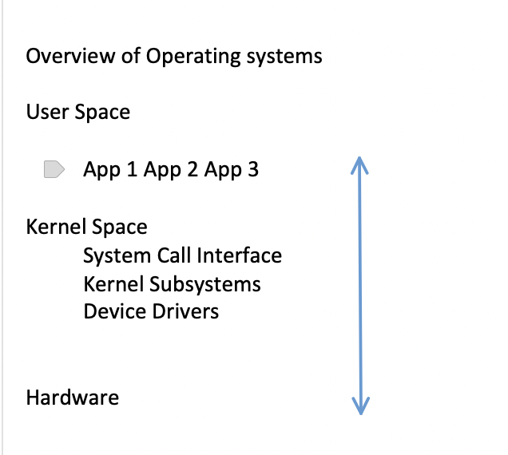

Project tentative topics (maybe only choose 3):
  - Adding new system calls
  - Kernel module - data structure handling
  - Handling page faults from the user-space with userfaultfd
  - An OS virtualization lab - virtualize a simple random number generator (RNG)

Final research
  - TBD (semester long research project, group of ~2)
  - Target high (aim to make a paper submission to SOSP/OSDI/APSys)

History of Linux and Overview of the Linux Kernel

Overview of Operating systems

User space v Kernel Space
A CPU is executing in either user space or kernel space
Only the kernel is allowed to perform privileged operations such as controlling CPU and IO devices
  - e.g., protection rings in x86 architecture
  - ring 3: user-space application; ring 0: OS kernel

A user-space application talks to the kernel through the system call interface
  - E.g., open(), read(), write(), close()

Linux is a monolithic kernel

A traditional design: all of the OS runs in kernel, privileged mode
  - Share the same address space

Kernel interface ~= system call interface
Good: easy for subsystems to co-operate
  - One cache shared by file system and virtual memory
Bad: leads to bugs, no isolation within the kernel

Alternative: micro-kernel design

Many OS services run as ordinary user programs
  - E.g., file system in a file server
Kernel implements minimal mechanism to run services in user space
  - IPC, virtual memory, threads
Kernel interface != system call interface
  - Applications talk to servers via IPCs

Course Setup
VirtualBox to run Linux VM
  - Recommended
    - Disk >=64GB, RAM >= 4GB, # CPU = 2
  - Add port forwarding rule
    - Protocol: TCP, Hope IP: 127.0.0.1
    - Host port: 2222, guest port: 22
  - Might have to use VMWare for ARM
	
CloudLab
  - https://cloudlab.us

Ubuntu 22.04 server for linux distro
  - Add your account as sudo user
    - Sudo usermod -aD sudo xiaoguabg
  - Tricks to avoid typing pwd everytime
  - sudo visudo
  - xiaoguang ALL=(ALL)
