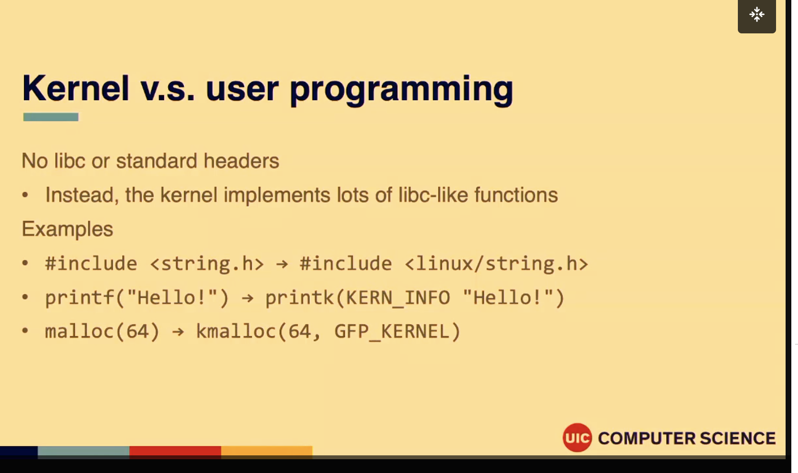
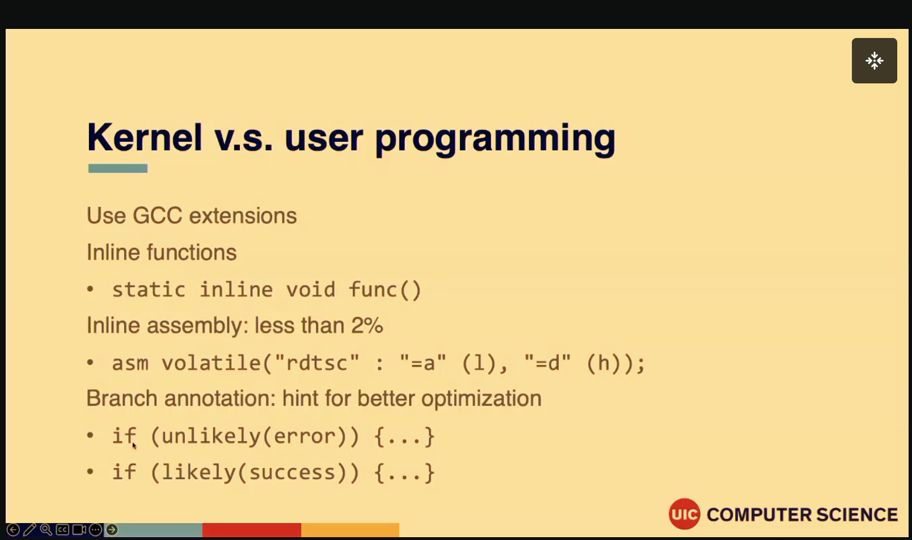
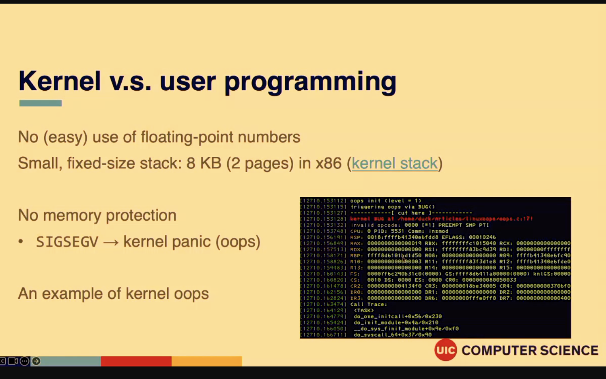
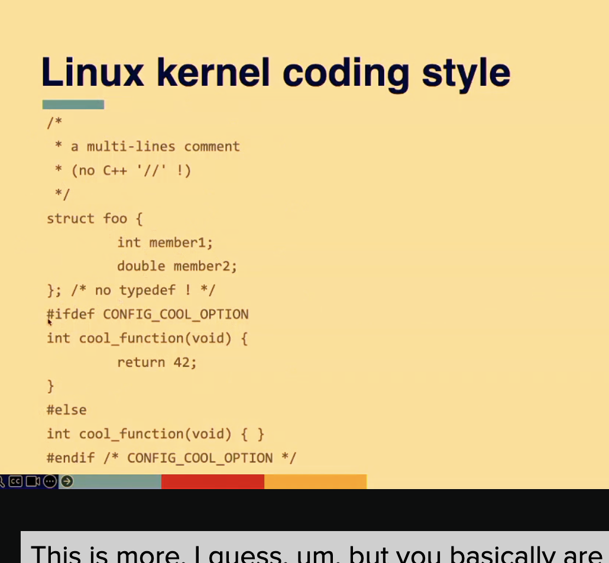

Kernel vs user programming

The Linux Kernel does not include the standard C library or libc, instead the kernel implements many libc-like functions 

No (easy) use of floating-point numbers
Small, fixed-size stack: 8KB (2 pages) in x86 kernel stack

No memory protection
	- SIGSEGV -> kernel panic (oops)

Synchronization and concurrency
	- Multi-core processor -> synchronization among tasks
		○ A piece of kernel code can execute on two or more processors
	- Preemptive multitasking -> synchronization among tasks
		○ A task can be scheduled and re-scheduled at any time 
	- Interrupt -> synchronization with interrupt handlers
		○ Can occur during execution (e.g., accessing resource)
		○ Need to synchronize with interrupt handler

Linux Kernel coding style
	- Indentation: 1 tab -> 8 character width (not 8 spaces)
	- No CamelCase, use underscores: SpinLock -> spin_lock
	- Use C-style comments: /* user this style */ //not this
	- Line length: 80 column
	- Write code in a similar style with other kernel code
EX:

		
		
Summary of tools:
	- Version control: git, tig
	- Congirue the kernel: make oldconfig
	- Build the kernel: $ make -j8; make modules -j8
	- Install the kernel: $ make install; make modules_install
	- Explore the code: $ make cscope tags -j2; cscope, ctags
	- Editor: vim, emacs
	- Screen: tmux
	- Terminal ssh
	- Courses talking about tooling: https://missing.csail.mit.edu
	
Next Lecture

Isolation and system calls
Explore how following system calls are implemented in the kernel

fd = open("out", 1);
write(fd, "hello\n", 6);
pid = fork();

