# Isolation and System Calls

Get, build and explore the Linux kernel
  - Git, tig, make, make modules, make modules_install, make install, vim, emacs, LXR, cscope, ctags, tmux
  - Don't try to master them at once.  Instead gradually get used to them

Questions: Other vim tools? "vim-plug" for vim plugin management 

```sh
$ git clone --depth=1 https://github.com/xgwang9/.vim.git ~/.vim
$ cd ~/.vim
$ sh install.sh
```

How to read kernel code

E.g., ext4 file system
  1. General understanding of OS file systems <- and OS textbook
  2. File system in Linux kernel
  3. Check kernel Documentation and Ext4 on-disk layout
  4. Read the ext4 kernel code
    a. Module by module; start from a system call (e.g., how sys_write() is implemented?)
  5. Search LWN to check the latest changes -> E.g., ext4 encryption support

Use function tracer
  - Ftrace: function tracer framework
  - Perf tools: ftrace front end
    ○ Try "kernel/funcgraph"
  - Try "bpftrace"

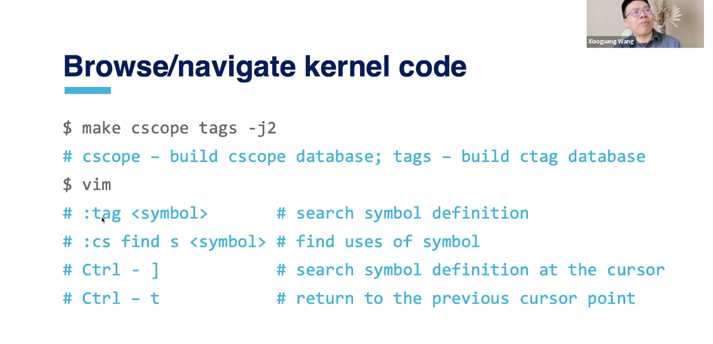

The unit of isolation: "process"

Prevent process X from accessing or spying on process Y
  - E.g., memory, address space, FDs, cpu, etc.

Prevent a process from maliciously accessing the operating system itself
  - E.g., a buggy or malicious program

How to isolate a process from kernel?
  - Hardware Isolation in x86
  - Ring 0: most privileged CPU mode - kernel
  - Ring 3: most unprivileged CPI mode - user

Segmentation in x86_64

Protected/long mode:
  - Protected is 32 bit, long is 64 bit
  - 15 bit segment registers store a selector
    ○ %cs, %ds, %ss, %es, %fs, %gs
    ○ cs=co-segment, ds=data-segment, ss=segment selector
  - A selector contains an index to a segment descriptor table
  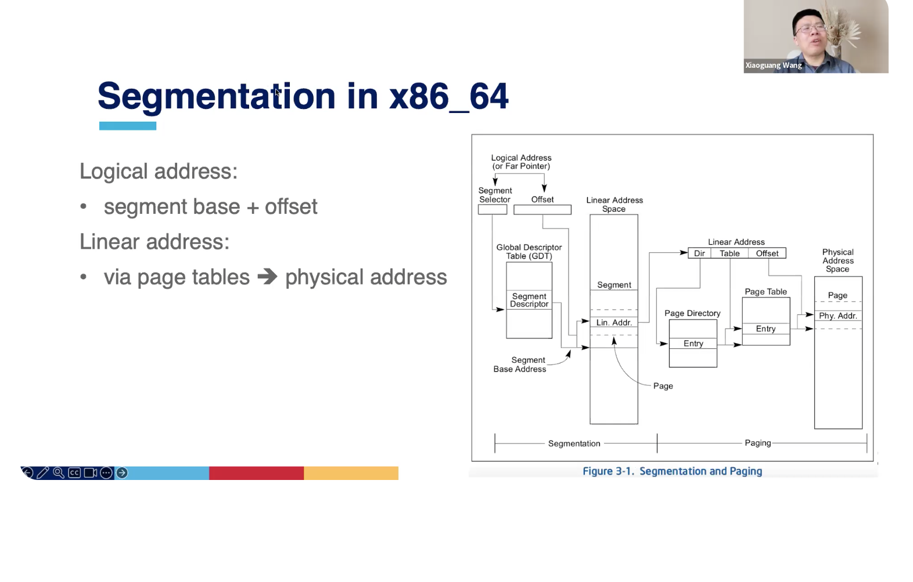
  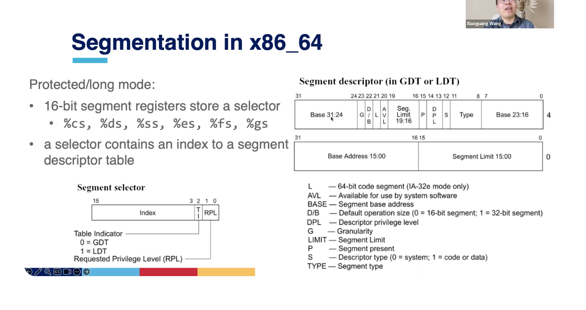
	


What does "ring 0" protect?

Protects everything relevant to isolation
  - Writes to %cs (to defend CPL)
  - I/O port access
  - Control register accesses (eflags, %cr3, …)

How to switch between rings?

Controlled transfer: system calls
  - Int 0x80, sysenter or syscall instructions set CPL to 0; 
Change to KERNEL_CS and KERNEL_DS segments
  - Set CPL to 3 before going back to user space; change to USER_CS and USER_DS segments

System calls
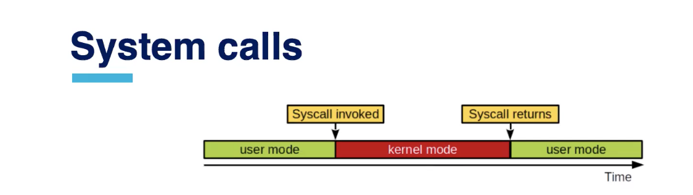

One way (the only way) for user-space application to enter the kernel to request OS services
  - A layer between the hardware and the processes
  - An abstract hardware interface for user-space
  - Ensure system security and stability

Examples of system calls
  - Process management/scheduling: fork, exit, execve, nice, {get|set} priority, {get|set} pid
  - Memory management: brk, mmap
  - File system: open, read, write, lseek, stat
  - Inter-Process Communication: pipe, shmget
  - Time management: {get|set} timeofday
  - Others: {get|set}uid, connect
Q: Where are the system call implementations in the kernel


Syscall table and identifier

The syscall table for the x86_64 architecture
  - Arch/x86/entry/syscalls/syscall_64.tbl
  - Syscall ID: unique integer (sequentially assigned)
  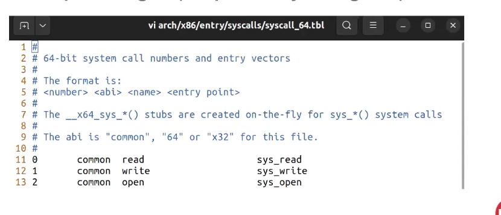


Sys_call_table

The syscall_64.tbl will be translated to an array of fuction pointers (sys_call_Table) on kernel build
  - Scripts/syscalltbl.sh
  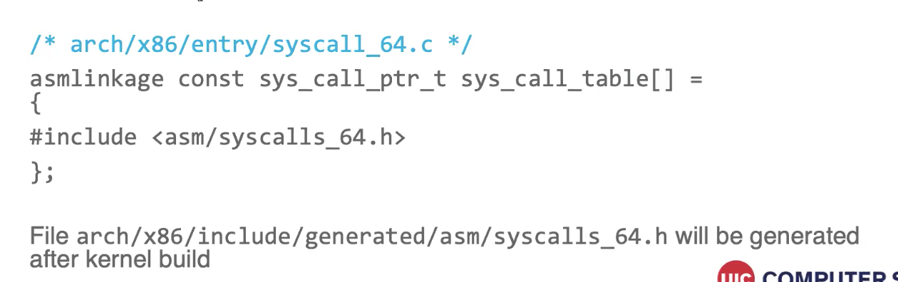


Syscall implementation
  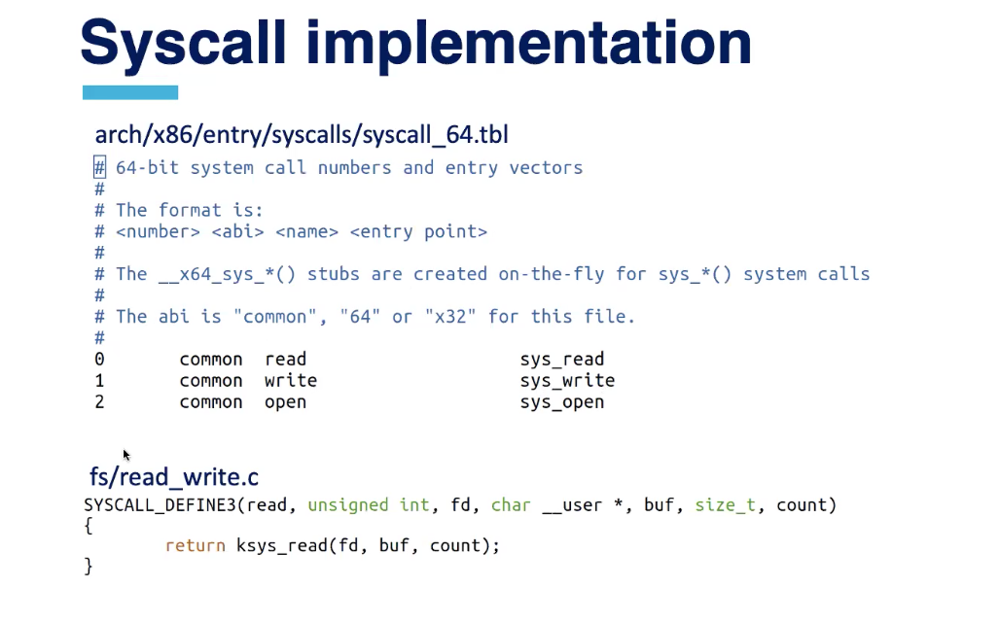


Syscalls are rarely invoked directly
  - Most of them are wrapped by the C library (libc, POSIX API)
  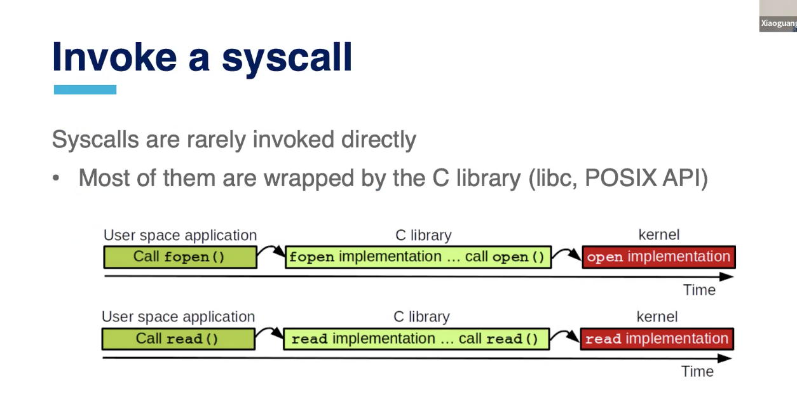


A syscall can be directly invoked via `syscall()`

System call instructions

X86 instruction for system call
  - Int 0x90: raise a software interrrupt 128 (old)
  - Sysenter: fast system call (x86_32)
  - Syscall: fast system call (x86_64)
Passing a syscall ID and parameters
  - Syscall ID: %rax
  - Parameters (x86_64): %rdi, %rsi, %rdx, %r10, %r8 and %r9
  - If a function has more than six arguments, other parameters will be placed on the stack
  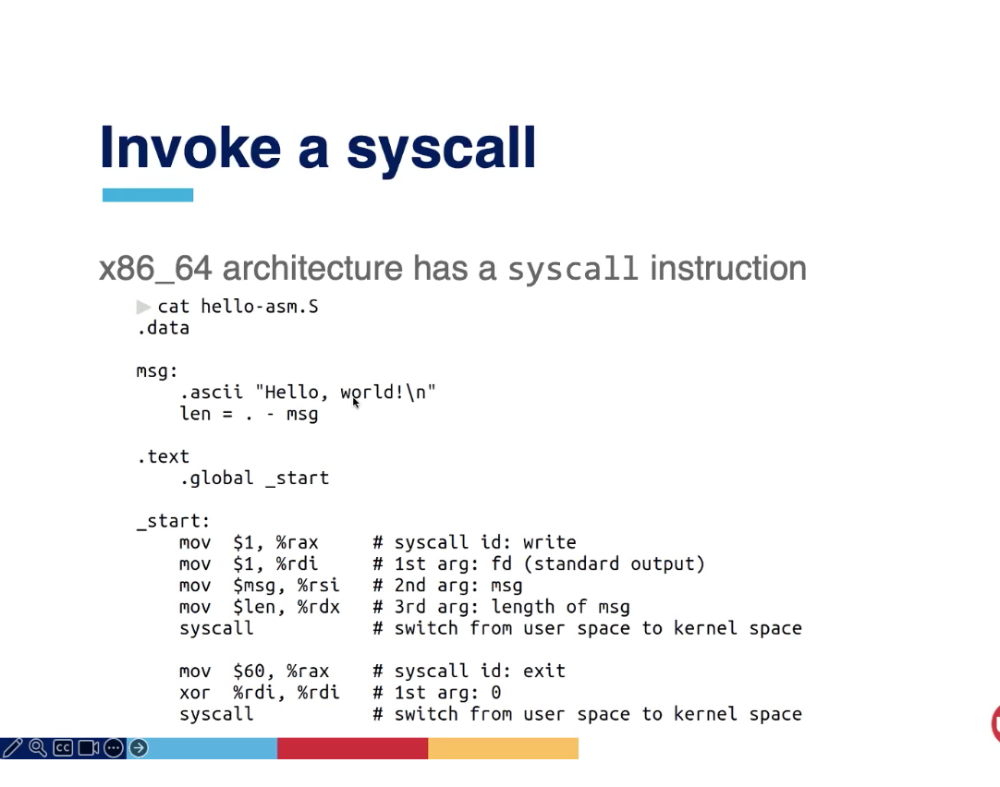


Handling the syscall interrupt
The kernel syscall interrupt handler, system call handler
  - Entry_SYSCALL_64 at arch/x86/entry/entry_64.S

Entry_SYSCALL_64 is registered at CPU init time
  - A handler of syscall is specified at IA32_LSTAR MSR register
  - The address of IA32_LSTAR MSR is set to entry_SYSCALL_64 at boot time: syscall_init() at arch/x86/kernel/cpu/common.c

Entry_SYSCALL_64 invokes the entry function for the syscallID
  - In arch/x86/entry/entry_64.S
  - Call do_syscall_64
  - Regs->ax = sys_call_table[nr](regs);
  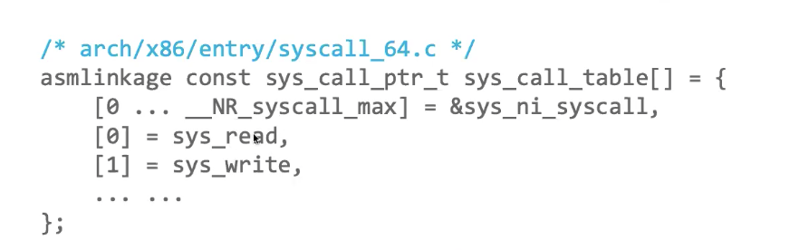

Return from the syscall

X86 instructions for system call
  - Iret: interrupt return (x86-32 bit, old)
  - Sysexit: fast return from fast system call( x86-64 bit)
  - Sysret: return from fast system call (x86-64 bit)

Gettimeofday example call
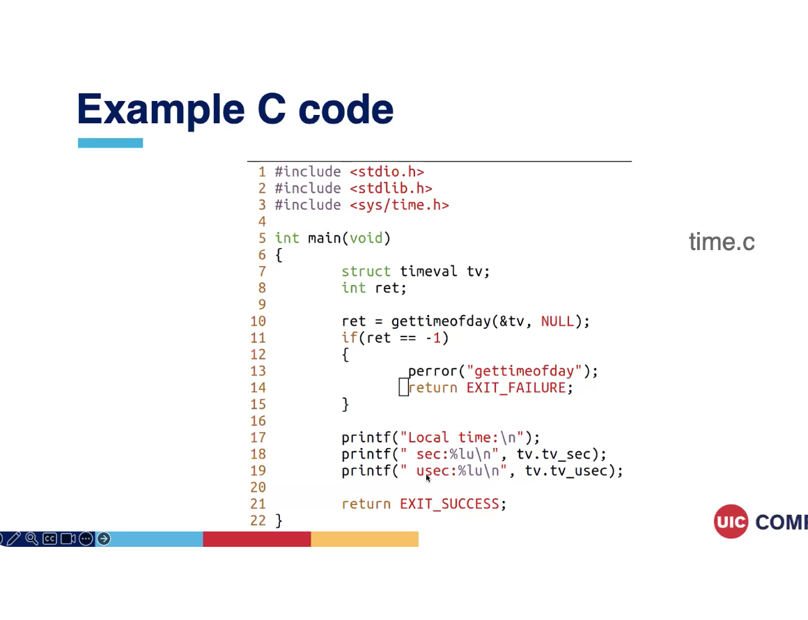

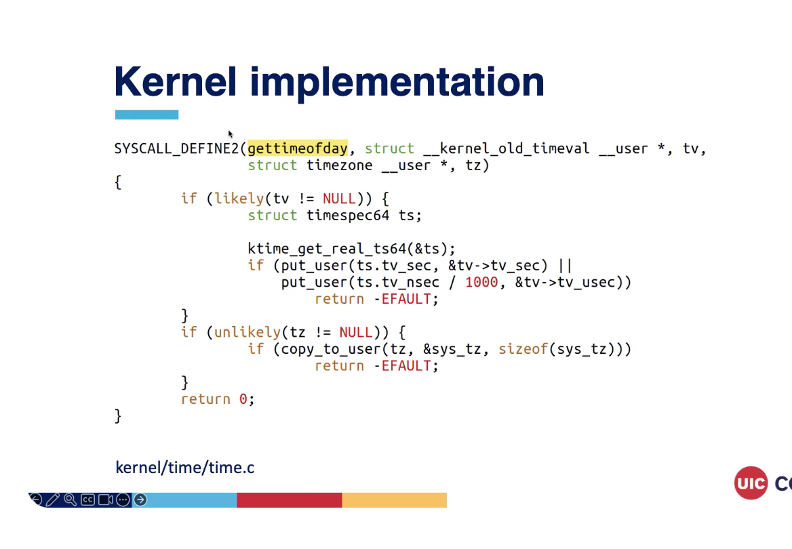

User space vs kernel-space memory

User space cannot access kernel memory:
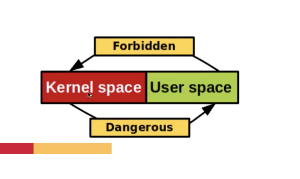

Kernel access of user memory is also considered dangerous
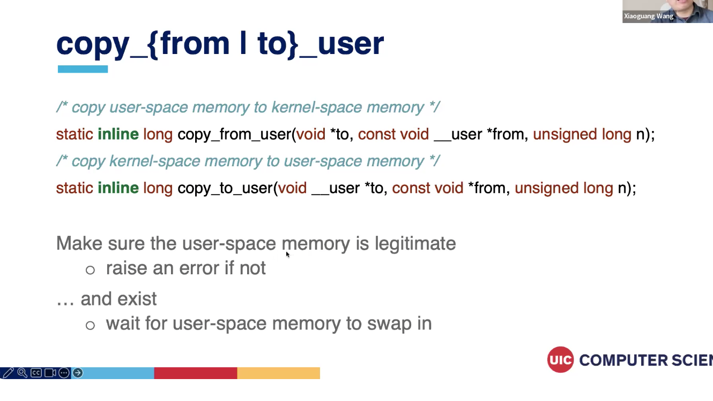


HMWK3
Implement a new system call
  1. Write your syscall function
  - Add the the existing file or create a new file
  - Add your new file into the kernel Makefile
  2. Add it to the syscall table and assign the ID
  - Arch/x86/entry/syscalls/syscall_64.tbl
  3. Add its prototype in include/linux/syscalls.h
  4. Compile, reboot, and run
  - Touching the syscall table will trigger the entire kernel compilation 

Example: syscall implemented in linux sources in my_syscall/my_func.c

Create a linux/my_syscall/Makefile
  - Obj-y += my_func.o

Add my_syscall in linux/Makefile
  - Core-y += kernel/ certs/ mm/ fs/ ipc/ security/ crypto/ block/ my_syscall/

Why not  add a new syscall
Pros: Easy to implement and use, fast
Cons:
  - Needs an official syscall number
  - Interface cannot change after implementation
  - Must be registered for each architecture
  - Probably too much for for small exchanges of information
Alternative:
  - Create a device node and read() write()
  - Use ioctl()


Improving syscall performance

Software: vDSO (virtual dynamically linked shared object)
  - A kernel mechanism for exporting a kernel space routines to user
  - No context switching overhead
  - E.g., gettimeofday()
    - The kernel allows the page containing the current time to be mapped read-only into user space

Summary
  - Isolation: CPU privilege on the x86 architecture
  - System calls: interface for applications to request OS services
  - Linux system calls: syscall table, syscall handler, and add a syscall
  - Improve syscall performance
