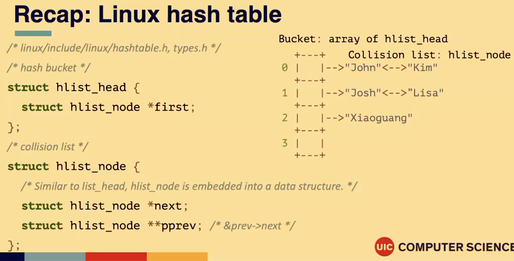
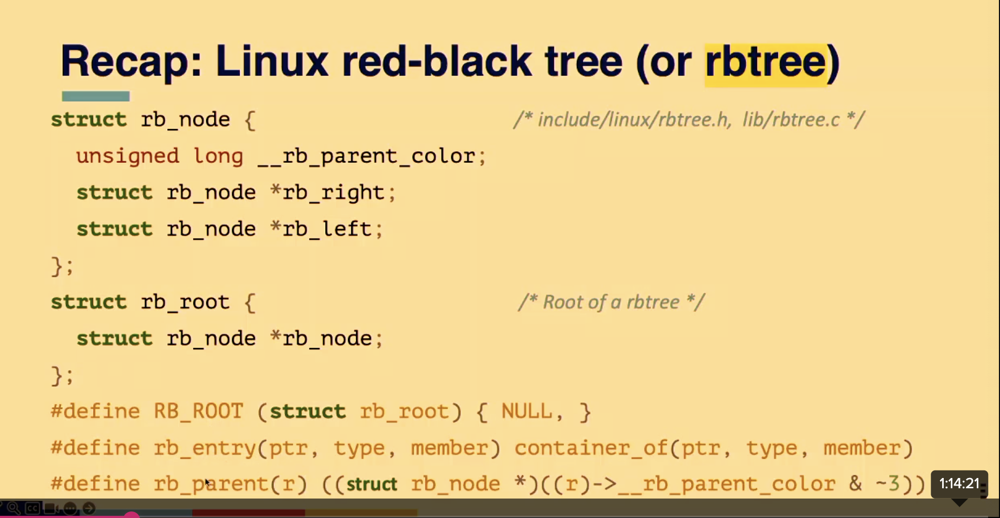
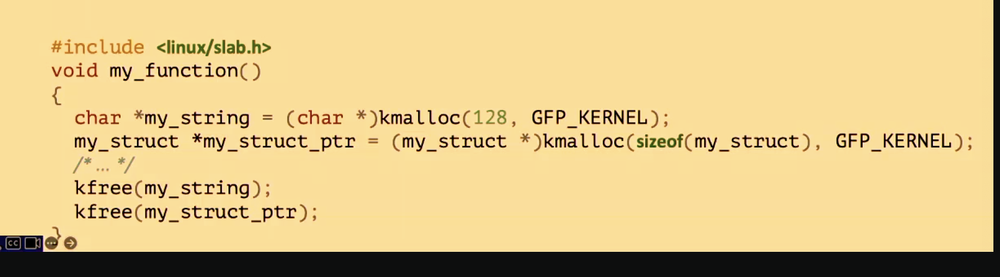
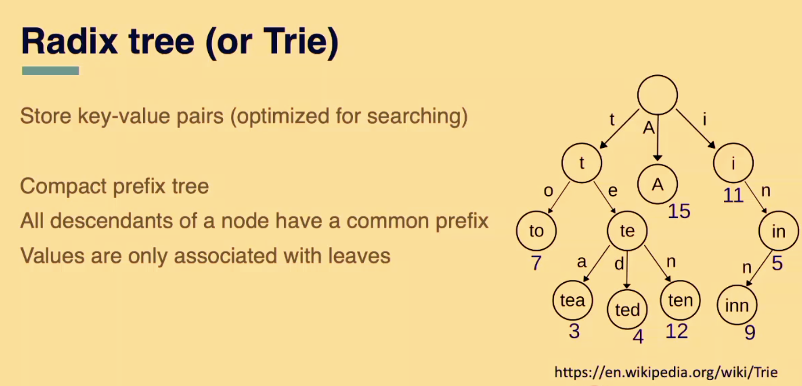
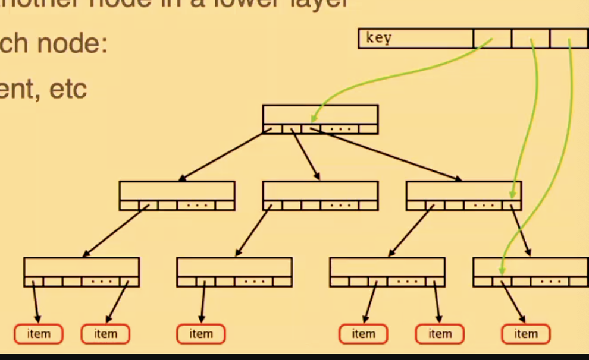

Kernel Data Structures II and Kernel Module

Recall LinkedList

struct list_head {
  struct list_head *next, *pev;
}

struct car {
  struct list_head list;
  unsigned int max_speed;
  unsigned int price_in_dollars;
};

struct list_head my_car_list;

struct car *my_car = list_entry(car_list_ptr, struct car, list);

How to get the pointer of the containing data structure (struct car) from its list?
	- Use list_entry(ptr, type, member)
	- Just a pointer arithmetic

Iterating over a LL: O(n)

Struct list_head p;

Struct car *current_car;

list_for_each (p, &my_carl_list) {
  current_car = list_entry(p, struct car, list);
  printk(KERN_INFO "Price: %ld\n", current_car->price_in_dollars);
}

// simpler
list_for_each_entry(current_car, &my_car_list, list) {
  printk(KERN_INFO "Price: %ld\n", current_car->price_in_dollars);
}

Agenda

Memory allocation in the kernel
More kernel data structures
	- Radix tree
	- Xarray
	- Bitmap
Kernel module

Memory allocation in kernel
Two types of memory allocation functions are provided
	- kmalloc(size, gfp_mask) 
		○ kfree(address)
	- vmalloc(size)
		○ vfree(address)
Gfp_mask is used to specify
	- Which types of pages can be allocated
	- Whether the allocator can wait for more memory to be freed
Frequently used: gfp_mask
	- GFP_KERNEL: a caller might sleep
	- GFP_ATOMIC: prevent a caller to sleep -> higher chance of failure 

Kmalloc(size, gfp_mask)
Allocate virtually and physically contiguous memory
	- Where physically contiguous memory necessary?
	

vmalloc(size)
Allocate memory that is virtually contiguous, but not physically contiguous
No size limit other than the amount of free RAM
Memory allocator might sleep to get more free memory
Unit of allocation is a page (4KB)

Linux radix tree
Mapping between a long integer key and a pointer value
Each node has 64 slots
Slots are indexed by a 6-bit (2^6 = 64 64) portion of the key
	- Tags, parent pointer, offset in parent, etc

 
 Recall the linux kernel radix tree is optimized to use a unsigned long as an index

From wiki: " Radix trees are useful for constructing associative arrays with keys that can be expressed as strings."

